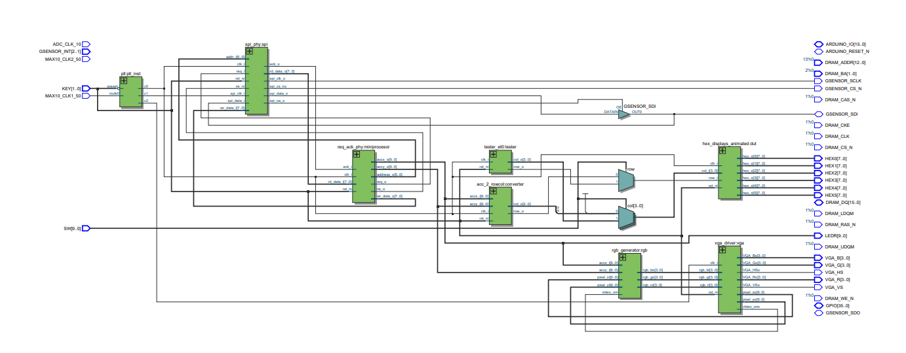

# FPGA Spirit Level

A digital spirit level implemented on the **DE10-Lite FPGA board**, using an ADXL345 accelerometer and a VGA display. The board's tilt is read over SPI and visualized in real time as a moving square on a 640×480 VGA screen, and 6 7 segement displays.

---

## Hardware

| Component | Details |
|---|---|
| FPGA Board | Intel DE10-Lite (MAX 10) |
| Accelerometer | ADXL345 (SPI interface) |
| Display | VGA 640×480 @ 60 Hz |

---

## Tools

- **Intel Quartus Prime** (synthesis & programming)
- **ModelSim** (simulation)
- Language: **Verilog / SystemVerilog**

---

## How it works?

**7 segment displays** — The `spi_phy` continuously polls the ADXL345 over SPI (3 wire mode) and outputs fresh signed 10-bit X and Y acceleration values. These are passed to `acc_2_rowcol`, converts them to `(row,collumn)` values. These values enter the `hex_displays_animated` and lights up the ball according to the coordaonates.

**VGA sqare** - The acceleartion values from `spi_phy` are passed to the `rgb_generator` that maps every pixel on the screen to a value of acceleration.

---

## RTL View

---
